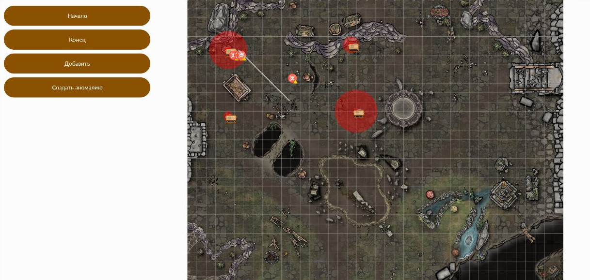

# Predprof

Реализация финального кейса Московской Предпрофессиональной Олимпиады школьников 2021/2022 по профилю **"Информационные технологии"** от команды **"Табуретка из трех ножек"**

**Задание кейса можно найти здесь:** [Командно-практическое задание ИТ](.github/task.pdf)

## Участники

* Арнаутова Алиса - [GitHub](https://github.com/LoveSeo8)
* Белоклоков Роман - [GitHub](https://github.com/witelokk)
* Гаджиев Эмиль - [GitHub](https://github.com/DumbyDum)
* Михедов Константин - [GitHub](https://github.com/KonstantIMP)
* Чичнев Даниил - [VK](https://vk.com/poluchaetsia)

